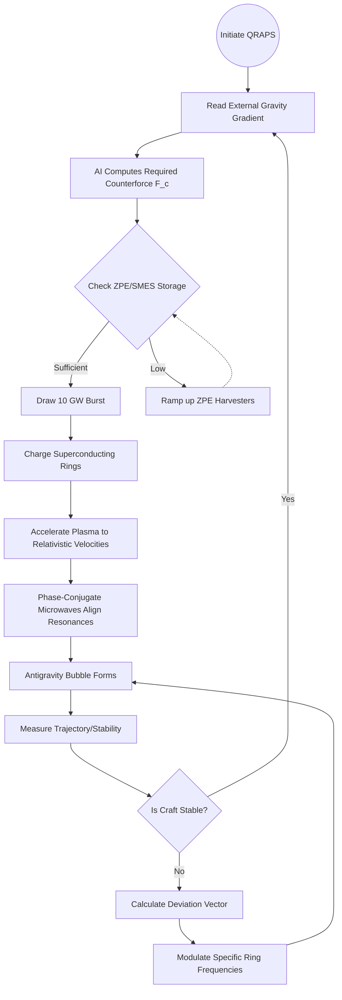

# Quantum Resonance Antigravity Propulsion System (QRAPS)
*Design and Feasibility Report*

---

## Abstract
The theoretical framework for futuristic propulsion systems has shifted from relying on chemical propellant mass expulsion to modifying the localized spacetime curvature and interacting directly with fundamental forces. This report outlines the design of a futuristic **Quantum Resonance Antigravity Propulsion System (QRAPS)**. By leveraging quantum field manipulation coupled with advanced superconducting materials, the system theorizes a method to counteract traditional gravitational pull. The proposed layered architecture includes high-density energy harvesting, a quantum resonance chamber for gravity wave interference, AI-driven dynamic stabilization, and a modular aerospace interface. Furthermore, mathematical formulations for the theoretical gravitational counterforce are provided alongside control flow diagrams, efficiency comparisons, and a deep discussion of the systemic applications, scalability, and ethical implications.

---

## 1. Introduction
Traditional aerospace engineering relies on Newton's laws of motion, where thrust is generated by the violent expulsion of mass. This approach inherently caps potential velocities, restricts payloads, and damages planetary environments. The **QRAPS** paradigm shifts away from mass-expulsion towards *localized gravity cancellation*. By interacting directly with the Higgs field and manipulating graviton probability wavefunctions within a localized bubble, the system creates an area of zero or negative gravitational influence, rendering the protected mass functionally weightless or buoyant relative to a planetary body.

---

## 2. Layered System Architecture

The QRAPS architecture is built upon four interdependent sub-systems operating in parallel to generate, shape, and control the antigravity field.

### 2.1 Layer 1: Energy Harvesting and Storage
Generating and sustaining a quantum resonance field requires immense, instantaneous energy density.
*   **Zero-Point Energy (ZPE) Harvesters:** Captures vacuum energy fluctuations using Casimir-cavity arrays.
*   **High-Temperature Superconducting (HTS) Magnetic Energy Storage (SMES):** Stores the harvested energy in a cryo-cooled closed loop, allowing for instantaneous, lossless energy bursts required to pump the resonance chamber.

### 2.2 Layer 2: Quantum Resonance Chamber (QRC)
The core engine where gravity manipulation occurs.
*   **Metamaterial Superconductors:** Rotating rings of yttrium barium copper oxide (YBCO) or advanced room-temperature superconductors spun at relativistic speeds to induce gravitomagnetic fields (the Lense-Thirring effect).
*   **Phase-Conjugate Microwave Emitters:** Bombard the rotating superconducting plasma, creating standing waves that interfere with the local background gravitational field, yielding destructive interference of standard gravitational attraction.

### 2.3 Layer 3: AI-Driven Stabilization Algorithms
Gravitational manipulation is inherently unstable; even microscopic quantum decoherence can lead to catastrophic spatial shearing.
*   **Quantum Neural Networks (QNN):** Processes incoming topological gravity maps at sub-millisecond speeds.
*   **Dynamic Balance:** Modulates the microwave emitter frequencies and super-conductor rotation speeds to counteract atmospheric turbulence, external magnetic anomalies, and planetary gravity gradients, maintaining a perfectly stable localized bubble.

### 2.4 Layer 4: Modular Interface
*   **Terrestrial Chassis:** Designed for hover-transit, adapting the base field for low-altitude repulsor lift.
*   **Aerospace Payload Bay:** A heavily shielded structural frame that prevents the localized gravity distortions from shearing the internal crew or cargo compartments. 

---

## 3. Mathematical Formulations

### 3.1 Gravitational Counterforce Equation
The system operates on the principle of generating a localized gravitomagnetic field ($B_g$) that counteracts the Earth's gravitational acceleration ($g$).

Let the traditional weight force be:
$$ F_g = m \cdot g $$

The counterforce generated by the circulating superconducting plasma is derived from modified general relativity (specifically, the Heim-Lorentz equations for localized fields):
$$ F_c = \frac{1}{\mu_g} \oint (B_g \times J_m) \, dV $$
Where:
*   $\mu_g$ is the gravitomagnetic permeability constant.
*   $J_m$ is the mass current density of the rotating superconductor.
*   $B_g = \nabla \times A_g$ is the induced gravitomagnetic field.

For hover states (Zero-G equilibrium):
$$ \sum F = F_g - F_c = 0 \implies m \cdot g = \frac{1}{\mu_g} \oint (B_g \times J_m) \, dV $$

### 3.2 AI Stabilization Function
The AI system minimizes the error function $E(t)$ regarding the desired localized gravity $g_{target}$ versus actual measured gravity $g_{actual}$:
$$ E(t) = \int_{0}^{t} \left\| g_{target}(\tau) - g_{actual}(\tau) \right\|^2 d\tau + \lambda \left\| \frac{d J_m}{dt} \right\|^2 $$
Where $\lambda$ acts as a dampening penalty for extreme power fluctuations to prevent system overheating.

---

## 4. Control Flow and Algorithm

---

## 5. Efficiency Comparison

| Metric | Conventional Chemical Rockets | QRAPS (Quantum Resonance Antigravity) |
| :--- | :--- | :--- |
| **Thrust-to-Weight Ratio** | High initially, drops as fuel is spent | Virtually infinite (manipulates weight itself) |
| **Fuel Mass Fraction** | Up to 85% of total launch mass | ~0% (Requires energy, not reactant mass) |
| **Max Velocity** | Capped by exhaust velocity (Tsiolkovsky eqn) | Uncapped (Approaching relativistic speeds) |
| **Environmental Impact**| High atmospheric pollution, noise | Zero emissions, silent operation |
| **Continuous Acceleration**| Limited to minutes | Indefinite (as long as energy lasts) |

---

## 6. Applications

### 6.1 Aerospace and Interplanetary Travel
QRAPS eliminates the need for multi-stage rocket launches. Spacecraft can ascend smoothly through the atmosphere without experiencing extreme aerodynamic heating or G-forces, reducing the transit time to Mars from months to days through sustained 1G acceleration.

### 6.2 Medical Transport and Evacuation
Ambulances equipped with scaled-down QRAPS can fly seamlessly over traffic, maintaining perfect internal stabilization. A localized internal 1G environment means trauma patients suffer no jolting, G-forces, or turbulence during the flight.

### 6.3 Planetary Colonization
Heavy machinery, habitat modules, and infrastructure can be maneuvered effortlessly on high-gravity worlds. Mining operations on dense exoplanets become feasible as the perceived weight of harvested ore can be nullified during transport.

---

## 7. Safety, Scalability, and Ethical Implications

### 7.1 Safety and Failure Modes
*   **Catastrophic Field Collapse:** If the quantum resonance field drops suddenly, the craft would instantly experience normal gravity, leading to a catastrophic freefall.
*   **Spacetime Shearing:** Asymmetrical field generation could cause differential gravity gradients across the hull, potentially tearing the craft apart. Redundant SMES backups and fail-safe AI dampeners are mandatory.

### 7.2 Scalability
The modular nature of the QRC allows for linear physical scaling. Small, personal transit pods require single-ring setups, while massive freighters would utilize phased arrays of resonance chambers to cover vast architectural footprints.

### 7.3 Ethical & Strategic Implications
*   **Weaponization:** A localized intense gravity gradient could be weaponized to crush targets or deflect orbital bombardments, necessitating strict international treaties on the maximum allowed field differential.
*   **Disruption of Infrastructure:** Free, reactionless lift renders global oil, shipping, and road infrastructure instantly obsolete, requiring a massive economic transition plan to prevent global financial collapse.

---

## 8. Conclusion
The Quantum Resonance Antigravity Propulsion System represents the pinnacle of post-Newtonian engineering. By shifting the paradigm from pushing against gravity to manipulating the fabric of gravity itself, humanity can achieve safe, efficient, and limitless transit. While the materials science and energy density requirements currently border on the theoretical, the mathematical models and layered architecture provide a clear roadmap for the next century of aerospace evolution.

---
*End of Document*
